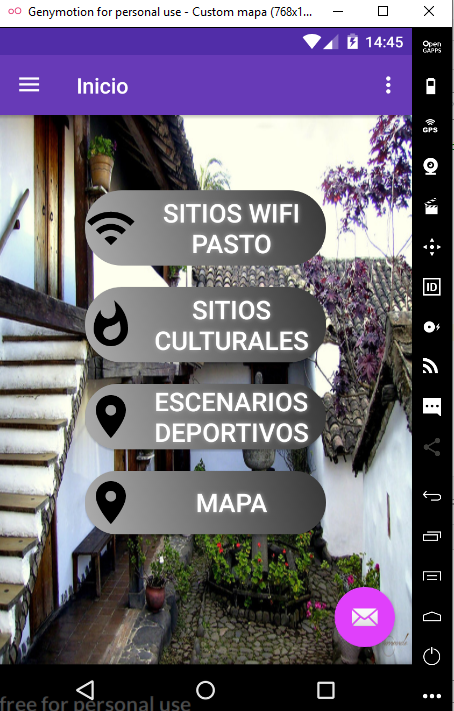
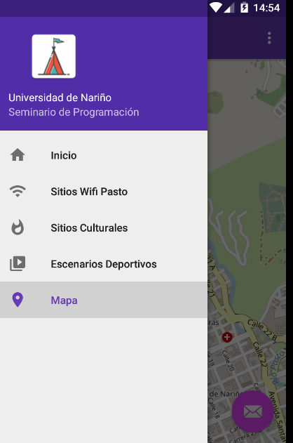
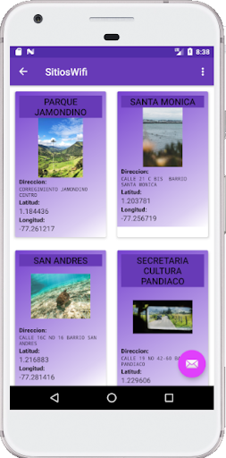
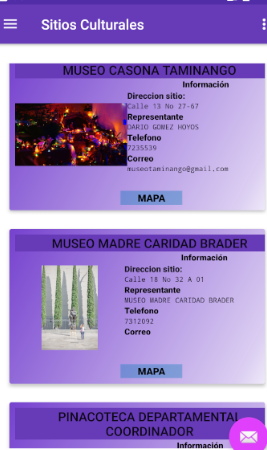
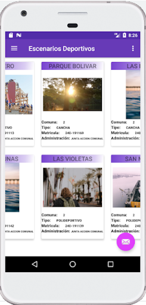

# TREEAPP
### La aplicación utiliza directamente tres apis de  datos colombia:

- Mapa de sitios culturales del municipio de Pasto a 25-04-2019
[url api sitios culturales](https://www.datos.gov.co/Salud-y-Protecci-n-Social/Mapa-de-sitios-culturales-del-municipio-de-Pasto-a/4zbg-ky2h)
- Sitios Wifi de San Juan de Pasto
- Escenarios Deportivos de San Juan de Pasto [Url api escenarios deportivos](https://www.datos.gov.co/Funci-n-p-blica/Escenarios-Deportivos-Municipio-De-PASTO/vx6j-j5fb)

Y una indirectamente ya que solo se utiliza la url concadenando una búsqueda aleatoria
[Unsplash](https://unsplash.com/).

### Pantalla de Inicio

La aplicación se realizó con una plantilla que suministra Android Studio, a la cual se adecuo según las necesidades, además se modificaron los colores que bien por defecto también se agregaron recursos nuevos como el degradado.xml, fondocarviewsite.xml que ayudan a dar opciones de color rápidos de cambiar.
Se realiza una nueva Activity para el SplashScreen y se realizan los respectivos cambios, luego de eso se generan las clases de acuerdo a datos json ofrecidos por las apis. Con la apiservice e  interface correspondiente se verifica que los datos son bien capturados.
Para mostrarlos en cada Fragment se realizan diseños de carview para cada uno de ellos, que en cada RecyclerView se adecuan por medio de un adaptador que ayuda la interfaz de la app.

Con esta explicación breve la app logra mostrar información correspondiente a la ciudad de Pasto.

